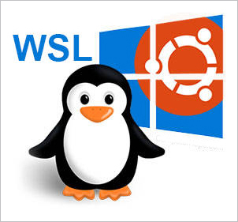

#  Windows SuBsystem Linux(WSL) :penguin:

   

## Descripción del Repositorio

Este repositorio contiene un proyecto educativo sobre Windows Subsystem for Linux (WSL). WSL es una característica poderosa de Windows que permite a los usuarios ejecutar un entorno Linux completo dentro de Windows, sin la necesidad de una máquina virtual o un arranque dual. Este proyecto está diseñado para proporcionar una guía comprensiva sobre WSL, incluyendo su instalación, configuración y uso.
Una máquina virtual requiere de la instalación de un sistema operativo completo dentro de un entorno virtualizado. WSL permite ejecutar Linux de forma más directa y eficiente, evitando tener que ejecutar dos sistemas operativos simultáneamente, ya que el entorno Linux se integra dentro de Windows.

## Contenido del Repositorio

1. **Introducción a WSL**:
   - Explicación de qué es WSL.
   - Beneficios y usos principales.
   - Diferencias entre WSL 1 y WSL 2.

**Enlace a:** [Introducción (¿Qué es WSL?)](quees.md)

2. **Guía de Instalación**:
   - Instrucciones paso a paso para habilitar y configurar WSL en Windows 11.
   - Configuración de WSL 2 como versión predeterminada.

**Enlace a:** [Guía de Instalación](guia.md)

3. **Instalación de Distribuciones Linux**:
   - Instrucciones detalladas para instalar y configurar Debian y Ubuntu.
   - Consejos para gestionar múltiples distribuciones.

**Enlace a:** [Instalación de distribuciones](distro.md)

4. **Procesos Asociados a WSL**:
   - Gestión y monitorización de procesos en WSL.
   - Integración y ejecución de comandos de Windows desde WSL y viceversa.
   - Herramientas y comandos útiles para la administración del entorno WSL.

**Enlace a:** [Procesos Asociados WSL](procesos.md)

5 **Desinstalar y copia de seguridad**:
   - ¿Cómo desinstalar WSL?
   - ¿Cómo hacer una copia de seguridad?

**Enlace a:** [Desinstalacion y copia de seguridad ](des&copy.md)

## Objetivo del Proyecto

El objetivo de este proyecto es proporcionar una referencia clara y accesible para estudiantes, desarrolladores y entusiastas de la tecnología que deseen aprender sobre WSL y cómo integrarlo en su flujo de trabajo diario. A través de guías prácticas y ejemplos detallados, los usuarios podrán:
- Configurar y utilizar WSL de manera efectiva.
- Explorar y entender las diferencias entre varias distribuciones de Linux en WSL.
- Aprovechar las capacidades de WSL para mejorar sus procesos de desarrollo y administración de sistemas.

## REFERENCIAS

<a href="https://www.xataka.com/" target="blank" title="Ir aquí">[XATAKA]</a>

<a href="https://chat.openai.com/" target="blank" title="Ir aquí">[CHATGPT]</a> 

<a href="https://learn.microsoft.com/es-es/windows/wsl/install" target="blank" title="Ir aquí">[MICROSOFT]</a> 

## Cómo Contribuir

¡Contribuciones al proyecto son bienvenidas! Si tienes sugerencias, correcciones o mejoras, no dudes en enviar un pull request. Para cuestiones o discusiones, abre un issue en el repositorio.

## Licencia

Este proyecto está licenciado bajo la [MIT License](LICENSE). Siéntete libre de usar, modificar y distribuir el contenido de este repositorio conforme a los términos de la licencia.
 
This work is licensed under <a href="http://creativecommons.org/licenses/by-sa/4.0/?ref=chooser-v1" target="_blank" rel="license noopener noreferrer" style="display:inline-block;">Attribution-ShareAlike 4.0 International</a>
 

## AUTORES

 :pushpin: [Cabezuelo Expósito, Adrián](https://github.com/AdrianCE94)

