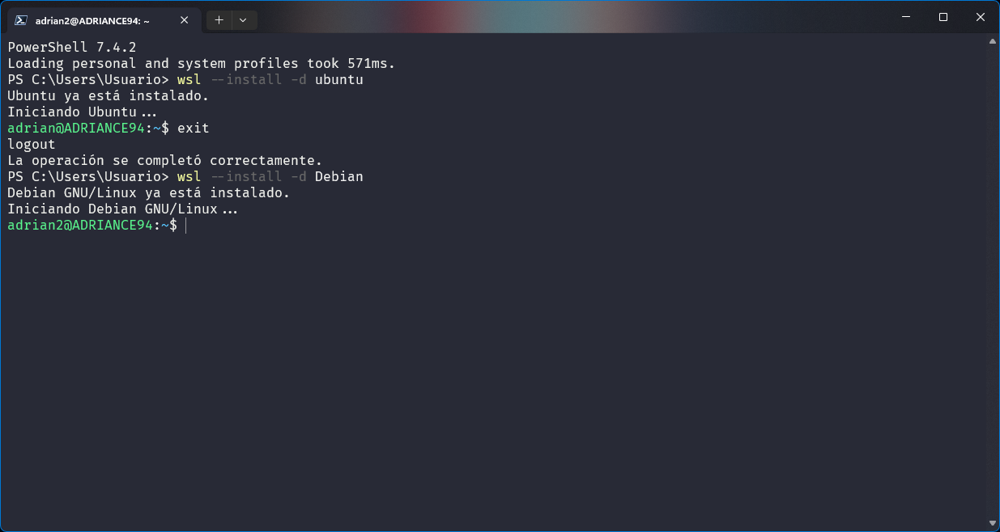
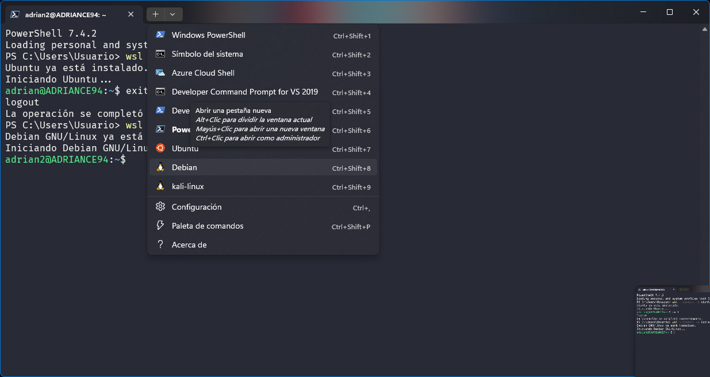
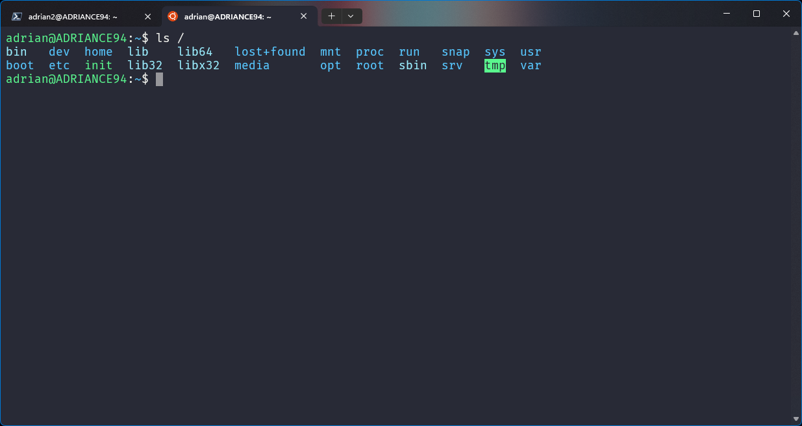

# Instalación de Distribuciones Linux en WSL

## Instrucciones detalladas para instalar y configurar Debian y Ubuntu en WSL

### Instalación de Debian en WSL

<p align="center">
   
</p>

1. **Habilitar WSL y instalar Debian**:
   - Abre PowerShell como administrador y ejecuta:
     ```powershell
     wsl --install -d Debian
     ```
   - Este comando habilitará WSL, instalará la última versión de WSL 2, y descargará e instalará Debian.




2. **Configurar Debian**:
   - Una vez completada la instalación, Debian se iniciará automáticamente.
   - Configura tu usuario y contraseña.
   - Actualiza los paquetes ejecutando:
     ```bash
     sudo apt update
     sudo apt upgrade
     ```

### Instalación de Ubuntu en WSL
<br>
<br>


1. **Habilitar WSL y instalar Ubuntu**:
   - Abre PowerShell como administrador y ejecuta:
     ```powershell
     wsl --install -d Ubuntu
     ```
   - Este comando habilitará WSL, instalará la última versión de WSL 2, y descargará e instalará Ubuntu.


2. **Configurar Ubuntu**:
   - Una vez completada la instalación, Ubuntu se iniciará automáticamente.
   - Configura tu usuario y contraseña.
   - Actualiza los paquetes ejecutando:
     ```bash
     sudo apt update
     sudo apt upgrade
     ```

## Consejos para gestionar múltiples distribuciones

- **Listar las distribuciones instaladas**:
  ```powershell
  wsl --list --verbose


<a href="README.md"></a>
