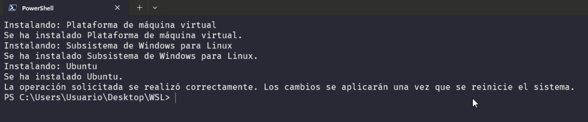
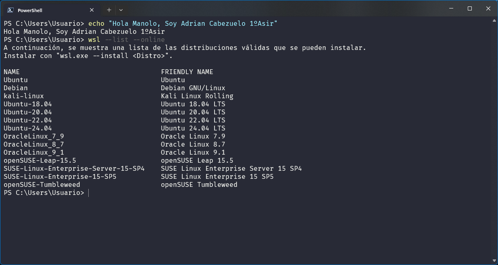
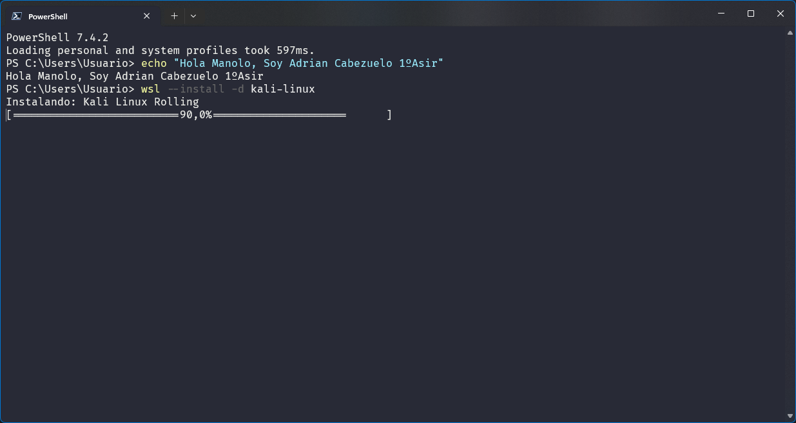

## Instalación de Linux en Windows con WSL
Los desarrolladores pueden acceder a la potencia de Windows y Linux al mismo tiempo en una máquina Windows. Subsistema de Windows para Linux (WSL) permite a los desarrolladores instalar una distribución de Linux (como Ubuntu, OpenSUSE, Kali, Debian, Arch Linux, etc.) y usar aplicaciones, utilidades y herramientas de línea de comandos de Bash directamente en Windows, sin modificar, sin la sobrecarga de una máquina virtual tradicional o una configuración de arranque dual.

## Prerrequisitos

Para ejecutar los siguientes comandos, debes ejecutar Windows 10 versión 2004 y posteriores (compilación 19041 y posteriores) o Windows 11. Si estas en versiones anteriores, consulta la [página de instalación manual](https://learn.microsoft.com/es-es/windows/wsl/install-manual).


## Comando de instalación de WSL
### PowerShell

```powershell
wsl --install
wsl --list --online  #para ver una lista de distribuciones disponibles 
wsl --install -d <DistroName>  #para instalar una distribución.

#Reiniar Maquina
#COMPROBACIONES
	
	wsl --list --verbose #VER DISTROS INSTALADAS
	wsl --update
	wsl --version
	wsl --status
	wsl --help
	wsl --shutdown
```

>Aplicamos el comando wsl --install



>Este comando habilitará las características necesarias para ejecutar WSL e instalará la **distribución Ubuntu** de Linux. (Esta distribución predeterminada se puede cambiar).

>Vemos las Distribuciones disponibles



## Cambio de la distribución predeterminada de Linux instalada

De forma predeterminada, la distribución de Linux instalada será Ubuntu. Se puede cambiar mediante la marca `-d`.

Para cambiar la distribución instalada, escriba: `wsl --install -d <Nombre de la Distribución>`. Reemplace `<Nombre de la Distribución>` por el nombre de la distribución que desea instalar.

Para ver una lista de las distribuciones de Linux disponibles para descargar a través de la tienda en línea, escriba `wsl --list --online` o `wsl -l -o`.

Para instalar distribuciones de Linux adicionales después de la instalación inicial, también puede usar el comando `wsl --install -d <Nombre de la Distribución>`.

>EJEMPLO INSTALANDO KALI-LINUX




### Sugerencia

Si desea instalar distribuciones adicionales desde dentro de una línea de comandos de Linux/Bash (en lugar de hacerlo desde PowerShell o el símbolo del sistema), debe usar `.exe` en el comando `wsl.exe --install -d <Nombre de la Distribución>` o para enumerar las distribuciones disponibles: `wsl.exe -l -o`.
*Se recomienda instalar Windows terminal desde Microsoft Store*

## Comprobación de la versión de WSL que se está ejecutando

Para enumerar las distribuciones de Linux instaladas y comprobar en qué versión de WSL está establecida cada una, puede escribir el comando `wsl -l -v` en PowerShell o en el Símbolo del sistema de Windows.


Para establecer la versión predeterminada en WSL 1 o WSL 2 cuando se instala una nueva distribución de Linux, use el comando `wsl --set-default-version <Número de Versión>`, reemplazando `<Número de Versión>` por 1 o 2.


+  más COMANDOS [aqui]( https://learn.microsoft.com/es-es/windows/wsl/basic-commands)

<br>
<br>
<a href="README.md"></a>

