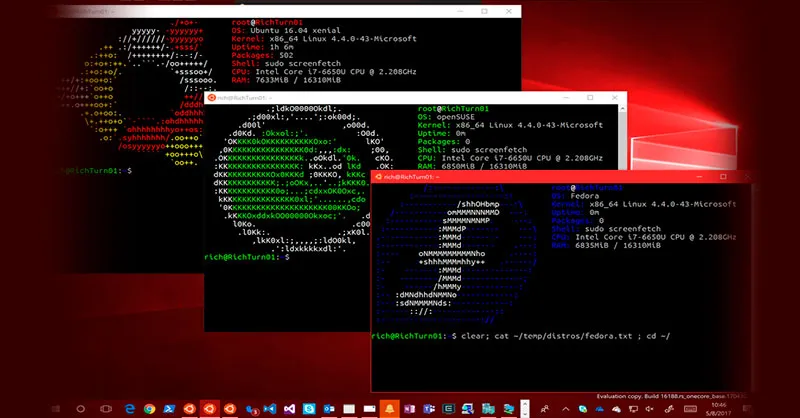

### 4. Procesos Asociados a WSL


#### Gestión de Procesos Asociados a WSL:

En el entorno de Windows Subsystem for Linux (WSL), existen procesos asociados que son importantes para su funcionamiento y la integración con el sistema operativo Windows. Aquí se detallan algunas consideraciones clave:

- **Servicios de WSL:** WSL puede tener servicios en ejecución que son necesarios para su operación. Estos servicios pueden ser administrados utilizando herramientas de administración de servicios de Windows.

- **Procesos de Interfaz de Usuario de WSL:** WSL puede lanzar procesos de interfaz de usuario (UI) que interactúan con el entorno gráfico de Windows. Estos procesos pueden ser administrados a través del Administrador de Tareas de Windows.

- **Procesos de Integración:** WSL puede iniciar procesos de integración que facilitan la comunicación entre los sistemas de archivos de Linux y Windows. Estos procesos pueden ser visualizados y controlados desde la interfaz de usuario de Windows.

- **Procesos de Puente:** WSL puede iniciar procesos de puente que actúan como intermediarios entre las aplicaciones de Windows y las aplicaciones de Linux. Estos procesos son esenciales para la integración de aplicaciones y pueden ser administrados mediante herramientas de administración de procesos de Windows.

#### Monitorización y Gestión:

Es importante monitorear y gestionar adecuadamente los procesos asociados a WSL para garantizar un funcionamiento óptimo del entorno. Esto puede implicar la supervisión de recursos, la resolución de problemas de rendimiento y la gestión de servicios en ejecución según sea necesario.

Desde PowerShell, puedes ejecutar comandos de WSL:
```
wsl ls -la
```
