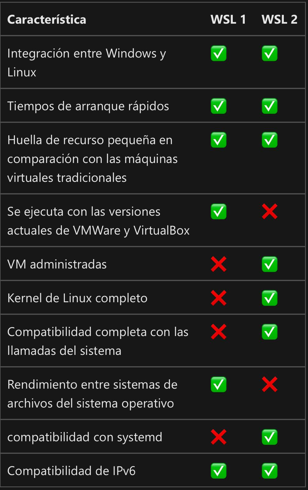

## 1. Introducción: ¿Qué es WSL?

WSL (Windows Subsystem for Linux) es una característica de Windows 10 y Windows 11 que permite a los usuarios ejecutar un entorno GNU/Linux directamente en Windows, sin necesidad de una máquina virtual o un arranque dual. WSL permite la ejecución de binarios de Linux en Windows de forma nativa, proporcionando una integración perfecta entre los dos sistemas operativos.

**Beneficios de WSL:**
- **Desarrollo:** Facilita el desarrollo de software que se va a ejecutar en servidores Linux.
- **Compatibilidad:** Permite usar herramientas y scripts de Linux en un entorno Windows.
- **Rendimiento:** Ofrece un mejor rendimiento que las máquinas virtuales, ya que no hay una sobrecarga significativa.
- **Facilidad de uso:** Se integra con las aplicaciones y sistemas de archivos de Windows.

# DIFERENCIAS
## WSL 1

- **Arquitectura:** Basada en una traducción dinámica de llamadas de sistema de Linux a llamadas de sistema de Windows.
- **Kernel:** Utiliza el kernel de Windows para ejecutar binarios de Linux.
- **Rendimiento de E/S:** Limitado por la traducción de llamadas de sistema y la implementación del sistema de archivos.
- **Rendimiento de red:** Depende de la pila de red de Windows.
- **Requisitos del sistema:** Funciona en todas las ediciones de Windows 10.
- **Integración:** Limitada con el sistema de archivos y la red de Windows.
- **Administración de recursos:** No ofrece control sobre la asignación de recursos de CPU y memoria para las distribuciones de Linux.

## WSL 2

- **Arquitectura:** Basada en una máquina virtual ligera.
- **Kernel:** Utiliza un kernel Linux completo.
- **Rendimiento de E/S:** Mejorado gracias a la virtualización de sistemas de archivos y el uso del kernel Linux.
- **Rendimiento de red:** Mejorado gracias a la integración de la pila de red de Linux.
- **Requisitos del sistema:** Requiere Windows 10 versión 1903 o posterior con virtualización habilitada.
- **Integración:** Mayor integración con el sistema de archivos y la red de Windows.
- **Administración de recursos:** Permite controlar la asignación de recursos de CPU y memoria para las distribuciones de Linux.

## ¿Qué arquitecturas admite WSL?

- WSL admite CPU x64 y Arm.
- Esto amplía significativamente la versatilidad y la utilidad de WSL para desarrolladores y usuarios que trabajan en diferentes arquitecturas de hardware.

### COMPARATIVA

 
 

